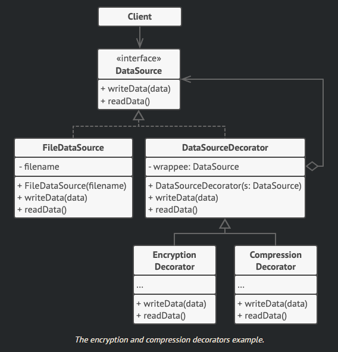

# Design patterns

## Strategy

- [ ] Descrever Strategy

## State

- [ ] Descrever State

## Chain of Responsibility

- [ ] Descrever Chain of Responsibility

## Decorator

Decorator é um padrão estrutural.

Este pattern nos permite adicionar responsabilidades a objetos especificos e não a toda uma classe. Essas responsabilidades são adicionadas em tempo de execução.

Ao contrário da herança que aplica uma responsabilidade `a toda classe`, o
Decorator aplica uma responsabilidade a um `objeto especifico`.

A funcionalidade necessária pode ser composta a partir de peças simples. Evitando que classes fiquem sobrecarregadas com funcionalidades que não usam.

  

Uma classe Decorator deve seguir a mesma interface da classe a ser decorada.

Todo decorador tem um atributo do tipo do componente que será decorado.

O decorator também deve implementar os métodos a serem decorados.

Nesse pattern aplicamos os principios  da responsabilidade única, da substituição de Liskov e da inversão de dependência - S, L e I dos principios SOLID.

Isso ocorre porque cada Decorator tem alta coesão, se comporta da mesma maneira que a superclasse e não depende de outras classes, mas sim de suas abstrações (interfaces).
